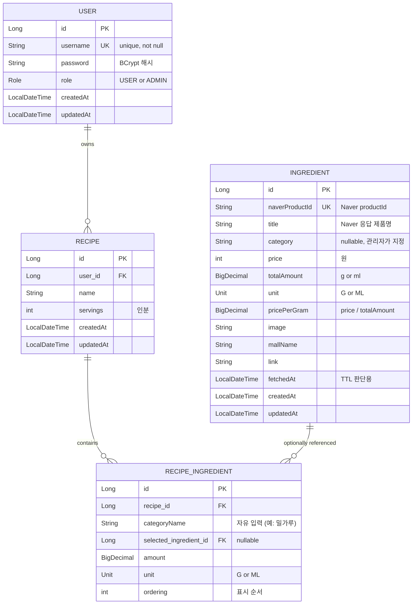

# coastCalculator

레시피 입력 시 네이버 쇼핑 가격 기반으로 **1g(또는 1ml)당 단가**를 정규화해서 총 원가와 인분당 단가를 계산해 주는 웹 서비스.

## 핵심 인사이트

원가 계산은 보통 업소용 대용량(예: 밀가루 20kg) 기준으로 이뤄지므로, 단순히 제품 가격이 아니라 **단위 무게/부피당 가격**으로 정규화해서 저장 → 어떤 규격의 제품이든 공정한 비교가 가능.

## 기술 스택

- **Language / Framework**: Java 25, Spring Boot 4.0.6
- **Build**: Gradle
- **DB**: MySQL 8.4 (Docker)
- **ORM**: Spring Data JPA (Hibernate)
- **View**: Thymeleaf + Spring Security 통합
- **Auth**: Spring Security (자체 회원가입 / BCrypt / Form Login)
- **External**: 네이버 검색 API (쇼핑)

## ERD



### 관계 정리

- `USER` 1 — N `RECIPE`: 한 사용자가 여러 레시피 소유
- `RECIPE` 1 — N `RECIPE_INGREDIENT`: 레시피 안에 여러 재료 행
- `INGREDIENT` 1 — N `RECIPE_INGREDIENT`: **선택적 참조** — 사용자가 특정 제품을 직접 고른 경우만
- 기본 원가 계산은 `RecipeIngredient.categoryName` + `unit`으로 `Ingredient` 후보를 조회하고 `PricingPolicy`에 따라 단가 결정 (예정)

## 주요 기능

### 인증 / 권한

- 자체 회원가입 / 로그인 (`/signup`, `/login`)
- 초기 `admin / admin123!!` 관리자 계정 자동 시드 (멱등 — 이미 있으면 skip)
- `ROLE_USER` / `ROLE_ADMIN` 분리
  - `/admin/**`: 관리자 전용
  - `/recipes/**`, `/ingredients`: 인증 필요
  - `/`, `/login`, `/signup`: 공개

### 재료 (Ingredient)

- 관리자가 `/admin/ingredients/fetch`에서 네이버 검색 키워드 입력 → API 호출 → 응답에서 단위(g/kg/L/ml) 자동 파싱 후 DB 저장
- `naverProductId` 기준 upsert — **재호출 시 가격/메타데이터는 갱신하되 관리자가 부여한 카테고리는 보존**
- 관리자가 `/admin/ingredients`에서 row별로 카테고리 지정 (자유 입력)
- 일반 사용자는 `/ingredients`에서 카테고리 지정된 재료만 조회 가능
- TTL 24시간 — stale 데이터는 사용자 조회 시 자동 refetch
- `MockNaverShoppingClient` 제공 — API 키 없이도 개발 가능

### 레시피 (Recipe)

- 본인 레시피만 조회/수정/삭제 가능 (소유자 체크)
- `/recipes` 목록, `/recipes/new` 생성, `/recipes/{id}` 수정
- 재료 입력은 **고정 10행**, 빈 행은 저장 시 무시
- 재료별 단위 분리 (`amount` + `unit`) — 무게(g)와 부피(ml) 혼재 가능

## 실행 방법

### 1. MySQL (Docker)

```bash
docker compose up -d
```

### 2. 애플리케이션 실행

**기본 (Mock 모드, 네이버 API 키 불필요)**:
```bash
./gradlew bootRun
```

**실제 네이버 API 호출 (local 프로파일)**:

`src/main/resources/application-local.yaml` 생성 (`.gitignore`로 보호됨):
```yaml
naver:
  api:
    client-id: <발급받은 값>
    client-secret: <발급받은 값>
    mock-enabled: false
```

```bash
./gradlew bootRun --args='--spring.profiles.active=local'
```

### 3. 접속

- 홈: http://localhost:8080
- 관리자 로그인: `admin` / `admin123!!`

## 진행 상태

| # | 단계 | 상태 |
|---|---|:---:|
| 1 | 인프라 설정 (application.yaml, docker-compose, SecurityConfig) | ✅ |
| 2 | User 도메인 (엔티티 + 회원가입/로그인) | ✅ |
| 3 | Ingredient 도메인 + 네이버 API + admin seed + 권한 분리 | ✅ |
| 4 | Recipe 도메인 (CRUD) | ✅ |
| 5 | 원가 계산 서비스 + 결과 페이지 | ⏳ |
| 6 | 마무리 (예외 처리, 통합 점검) | ⏳ |

## 디렉터리 구조

```
src/main/java/com/goosepl/coastCalculator/
├── config/                  SecurityConfig, NaverApiProperties
├── domain/
│   ├── user/                User, Role, UserService, CustomUserDetailsService, DataInitializer
│   ├── ingredient/          Ingredient, Unit, IngredientService
│   └── recipe/              Recipe, RecipeIngredient, RecipeService
├── external/naver/          NaverShoppingClient (인터페이스) + Mock/Real 구현, UnitParser
└── web/
    ├── (AuthController, HomeController, IngredientController, RecipeController)
    └── admin/               AdminIngredientController
```

```
src/main/resources/
├── application.yaml         기본 설정 (Mock 모드)
├── application-local.yaml   실제 API 키 (gitignore)
└── templates/               Thymeleaf 페이지
```

## 환경 변수 / 설정 요약

| 항목 | 기본값 | 비고 |
|---|---|---|
| MySQL 포트 (호스트) | 3309 | 컨테이너 내부는 3306 |
| DB 이름 | `coast_calculator` | |
| DB 사용자 | `coast` / `coastpass` | env로 override 가능 |
| Naver TTL | 24h | `naver.api.ttl-hours` |
| Naver 동시 가져오기 수 | 100건 | Naver 최대 |
| Mock 모드 | true | `naver.api.mock-enabled` |
