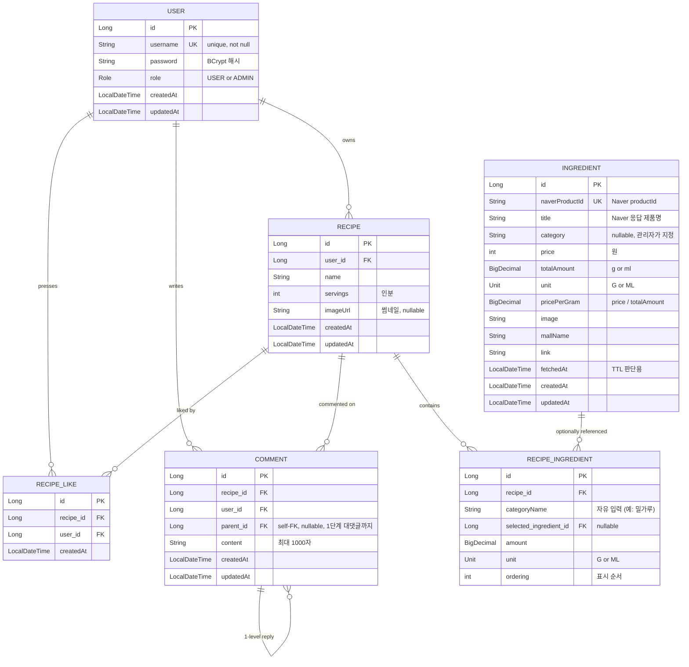

# coastCalculator

레시피 입력 시 네이버 쇼핑 가격 기반으로 **1g(또는 1ml)당 단가**를 정규화해서 총 원가와 인분당 단가를 계산해 주는 웹 서비스.
**레시피 공유 허브** 컨셉 — 모두가 공개 레시피를 둘러보고, 인증 사용자는 작성, 소유자만 수정/삭제.

## 핵심 인사이트

원가 계산은 보통 업소용 대용량(예: 밀가루 20kg) 기준이므로, 단순히 제품 가격이 아니라 **단위 무게/부피당 가격**으로 정규화해서 저장 → 어떤 규격의 제품이든 공정한 비교가 가능.

## 기술 스택

- **Language / Framework**: Java 25, Spring Boot 4.0.6
- **Build**: Gradle
- **DB**: MySQL 8.4 (Docker)
- **Migration**: Flyway 11.14 (`spring-boot-starter-flyway`) — `ddl-auto: validate` + V1 baseline
- **ORM**: Spring Data JPA (Hibernate)
- **View**: Thymeleaf + Spring Security 통합 (`thymeleaf-extras-springsecurity6`)
- **Auth**: Spring Security (자체 회원가입 / BCrypt / Form Login)
- **External**: 네이버 검색 API (쇼핑)
- **Storage**: 로컬 파일시스템 (`./uploads/`) — `ImageStorageService` 추상화
- **Container**: Dockerfile (멀티스테이지) + `docker-compose.prod.yml`

## ERD



### 관계 정리

- `USER` 1 — N `RECIPE`: 한 사용자가 여러 레시피 소유
- `RECIPE` 1 — N `RECIPE_INGREDIENT`: 레시피 안에 여러 재료 행
- `INGREDIENT` 1 — N `RECIPE_INGREDIENT`: **선택적 참조** — 사용자가 특정 제품을 직접 고른 경우만
- `RECIPE_LIKE` — `(recipe_id, user_id)` unique 제약으로 좋아요 중복 방지
- `COMMENT` — `parent_id` self-FK로 1단계 대댓글까지 허용 (손주 X)
- 원가 계산은 `RecipeIngredient.categoryName` + `unit`으로 `Ingredient` 후보를 조회 후 `PricingPolicy(LOWEST/AVERAGE/HIGHEST)`에 따라 단가 결정

## 주요 기능

### 인증 / 권한
- 자체 회원가입 / 로그인 (`/signup`, `/login`)
- 부팅 시 admin 계정 자동 시드 — `INITIAL_ADMIN_PASSWORD` 환경변수 우선, 미설정 시 `SecureRandom` 16자 랜덤 + 부팅 로그에 1회 노출
- `ROLE_USER` / `ROLE_ADMIN` 분리
  - **익명 공개**: `/`, `/login`, `/signup`, `/recipes/{id}` 조회, `/uploads/**`
  - **인증 필요**: `/recipes/new`, `/recipes/{id}/edit`, `POST /recipes/**` (생성/수정/좋아요/댓글)
  - **관리자 전용**: `/admin/**` (재료 fetch + 카테고리 수정 + 삭제)

### 재료 (Ingredient)
- 관리자가 `/admin/ingredients/fetch`에서 네이버 검색 키워드 입력 → API 호출 → 응답에서 단위(g/kg/L/ml) 자동 파싱 후 DB 저장
- `naverProductId` 기준 upsert — **재호출 시 가격/메타데이터는 갱신하되 관리자가 부여한 카테고리는 보존**
- 관리자가 `/admin/ingredients`에서 row별로 카테고리 지정 (자유 입력)
- 일반 사용자는 `/ingredients`에서 카테고리 지정된 재료만 조회 가능
- TTL 24시간 — stale 데이터는 사용자 조회 시 자동 refetch
- `MockNaverShoppingClient` 제공 — API 키 없이도 개발 가능
- **쿠팡 검색 링크** — `COUPANG_TRACKING_ID` 설정 시 어필리에이트 파라미터 부착(수익 채널), 미설정 시 일반 검색 URL

### 레시피 (Recipe)
- **공개 허브**: 홈(`/`)에 최근 레시피 그리드 + 이름 검색바
- 누구나 상세(`/recipes/{id}`) 열람 — 소유자에게만 수정/삭제 버튼 노출
- 본인 레시피만 수정/삭제 가능 (소유자 체크 → 위반 시 커스텀 403)
- 재료 입력은 **고정 10행**, 빈 행은 저장 시 무시
- 재료별 단위 분리 (`amount` + `unit`) — 무게(g)와 부피(ml) 혼재 가능
- **레시피 이미지** — 썸네일 1장, jpg/jpeg/png/webp, 최대 5MB. 편집 시 교체 또는 삭제
- N+1 회피용 `@EntityGraph` 적용된 Repository 메서드

### 원가 계산
- 상세 페이지에서 `PricingPolicy` 토글 (LOWEST=기본 / AVERAGE / HIGHEST)
- 재료별 단가 + 행 소계 + **전체 원가 + 인분당 단가** 모두 표시
- 매칭 실패한 재료(카테고리/단위에 등록 X) 경고 카운트 노출

### 커뮤니티
- **좋아요(toggle)** — 인증 사용자가 누를 수 있고 카운트 표시. `(recipe_id, user_id)` unique 제약으로 중복 방지
- **댓글 + 1단계 대댓글** — 인증 사용자만 작성, 작성자 또는 ADMIN만 삭제(수정 X), 부모 삭제 시 자식 cascade

### 에러 처리
- `@ControllerAdvice` 글로벌 핸들러: `AccessDeniedException`→403, `NoResourceFoundException`→404, `IllegalArgumentException`/`IllegalStateException`/`Exception`→500
- 커스텀 에러 페이지 `templates/error/{403,404,500,error}.html`
- 운영 안전성: `server.error.include-message: never`, whitelabel 비활성

## 실행 방법

### 1. MySQL (Docker)

```bash
docker compose up -d
```

### 2. 애플리케이션 실행 — local 프로파일 권장

`src/main/resources/application-local.yaml` 생성 (`.gitignore`로 보호):
```yaml
naver:
  api:
    client-id: <발급받은 값>
    client-secret: <발급받은 값>
    mock-enabled: false

app:
  admin:
    initial-password: admin123!!   # 로컬 개발용 고정 비번
```

```bash
./gradlew bootRun --args='--spring.profiles.active=local'
```

**Mock 모드(네이버 API 키 없이)**: `application-local.yaml`을 만들지 않고 `./gradlew bootRun`. 단, admin 비번은 부팅 로그에 1회만 노출되므로 즉시 복사.

### 3. 접속

- 홈: http://localhost:8080
- 관리자 로그인: `admin` / 위에서 설정한 비번 (또는 부팅 로그의 랜덤 비번)

### 4. (선택) 운영용 Docker 빌드

```bash
# 단일 머신 배포: 앱 + MySQL
docker compose -f docker-compose.prod.yml --env-file .env.prod up -d --build
```

자세한 배포 절차(EC2 등): [docs/deployment.md](docs/deployment.md)

## 진행 상태

| # | 단계 | 상태 |
|---|---|:---:|
| 1 | 인프라 설정 (application.yaml, docker-compose, SecurityConfig) | ✅ |
| 2 | User 도메인 (엔티티 + 회원가입/로그인) | ✅ |
| 3 | Ingredient 도메인 + 네이버 API + admin seed + 권한 분리 | ✅ |
| 4 | Recipe 도메인 (CRUD) | ✅ |
| 4.7 | 레시피 허브 (공개 조회 + 검색 + 홈 페이지 전환) | ✅ |
| 5 | 원가 계산 서비스 + PricingPolicy + 결과 페이지 | ✅ |
| 6 | 글로벌 예외 처리 + 커스텀 에러 페이지 | ✅ |
| 7 | 커뮤니티 (좋아요/댓글/대댓글) + 레시피 이미지 업로드 | ✅ |
| Stage A | 배포 준비 (admin 비번 외부화 + Dockerfile + 제휴 링크) | ✅ |
| T1-1 | Flyway 도입 (V1 baseline + `ddl-auto: validate`) | ✅ |

배포 readiness 백로그 전체는 [docs/improvements.md](docs/improvements.md) 참조.

## 디렉터리 구조

```
src/main/java/com/goosepl/coastCalculator/
├── config/                 SecurityConfig, NaverApiProperties, StorageProperties,
│                           AffiliateProperties, WebMvcConfig
├── domain/
│   ├── user/               User, Role, UserService, CustomUserDetailsService, DataInitializer
│   ├── ingredient/         Ingredient, Unit, IngredientService
│   ├── recipe/             Recipe, RecipeIngredient, RecipeService
│   ├── recipe/cost/        RecipeCostCalculator, PricingPolicy
│   ├── like/               RecipeLike, RecipeLikeService
│   └── comment/            Comment, CommentService + RootCommentView/ReplyView DTO
├── external/naver/         NaverShoppingClient (interface) + Mock/Real 구현, UnitParser
├── storage/                ImageStorageService (interface), LocalImageStorageService
├── affiliate/              AffiliateLinkBuilder
└── web/
    ├── (Auth/Home/Ingredient/Recipe/Like/Comment Controller)
    ├── admin/              AdminIngredientController
    └── error/              GlobalExceptionHandler
```

```
src/main/resources/
├── application.yaml            기본 설정 (Mock 모드)
├── application-local.yaml      실제 API 키 + 로컬 admin 비번 (gitignore)
├── db/migration/V1__init_schema.sql   Flyway 초기 스키마 (동결)
└── templates/                  Thymeleaf (recipes/, admin/, error/, ingredients/)
```

```
docs/
├── plan.md                작업 plan 전체 (Task별 상세, Verification 체크리스트)
├── improvements.md        배포 readiness 백로그 (Tier 1/2/3, 진행 상태 추적)
├── deployment.md          EC2 배포 가이드 (Stage A — IP 직접 접속)
├── troubleshooting.md     트러블슈팅 기록 (Spring Boot 4 모듈 분리, Naver 권한, LazyInit 등)
└── erd.html               Mermaid ERD (브라우저용)
```

## 환경 변수 / 설정 요약

| 항목 | 환경변수 | 기본값 | 비고 |
|---|---|---|---|
| MySQL URL | `SPRING_DATASOURCE_URL` | `jdbc:mysql://localhost:3309/coast_calculator?...` | |
| DB 사용자 | `DB_USERNAME` / `DB_PASSWORD` | `coast` / `coastpass` | |
| admin 사용자명 | `INITIAL_ADMIN_USERNAME` | `admin` | |
| admin 초기 비번 | `INITIAL_ADMIN_PASSWORD` | (랜덤 16자) | 미설정 시 부팅 로그에 1회 출력 |
| Naver Client ID | `NAVER_CLIENT_ID` | (비어 있음) | |
| Naver Client Secret | `NAVER_CLIENT_SECRET` | (비어 있음) | |
| Naver Mock 모드 | `NAVER_MOCK_ENABLED` | `true` | 키 있으면 `false`로 전환 |
| Naver TTL | (yaml only) `naver.api.ttl-hours` | `24` | |
| 업로드 디렉토리 | `UPLOAD_DIR` | `./uploads` | Spring static-locations로 `/uploads/**` 서빙 |
| 쿠팡 파트너스 ID | `COUPANG_TRACKING_ID` | (비어 있음) | 설정 시 어필리에이트 활성화 |

새 세션 컨텍스트는 [CLAUDE.md](CLAUDE.md)에 정리됨.
