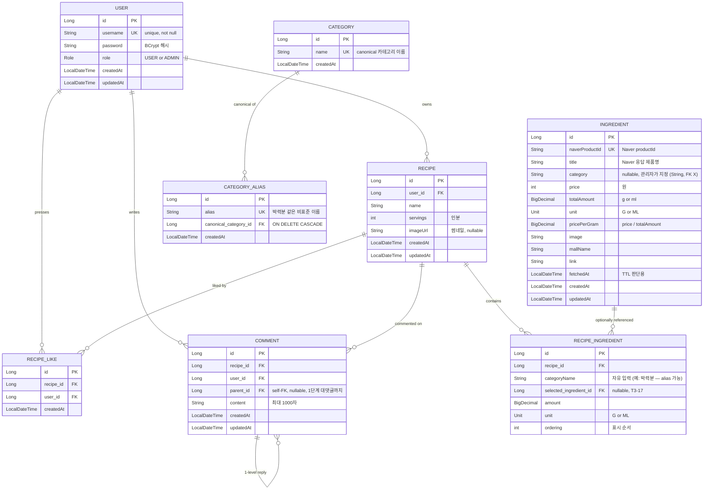

# coastCalculator

레시피 입력 시 네이버 쇼핑 가격 기반으로 **1g(또는 1ml)당 단가**를 정규화해서 총 원가와 인분당 단가를 계산해 주는 웹 서비스.
**레시피 공유 허브** 컨셉 — 모두가 공개 레시피를 둘러보고, 인증 사용자는 작성, 소유자만 수정/삭제.

[](https://github.com/Goospel/FoodCostCalculator/actions/workflows/ci.yml)

## 핵심 인사이트

원가 계산은 보통 업소용 대용량(예: 밀가루 20kg) 기준이므로, 단순히 제품 가격이 아니라 **단위 무게/부피당 가격**으로 정규화해서 저장 → 어떤 규격의 제품이든 공정한 비교가 가능.

## 기술 스택

- **Language / Framework**: Java 25, Spring Boot 4.0.6
- **Build**: Gradle
- **DB**: MySQL 8.4 (Docker)
- **Migration**: Flyway 11.14 (`spring-boot-starter-flyway`) — V1 baseline + V2 카테고리 마스터 + V3 카테고리 alias. `ddl-auto: validate`
- **ORM**: Spring Data JPA (Hibernate). `open-in-view: false` + `@EntityGraph`로 LazyInit 방어
- **View**: Thymeleaf + Spring Security 통합 (`thymeleaf-extras-springsecurity6`). **JS 없음 정책** — 인터랙션은 폼 POST + redirect, 자동완성은 HTML5 `<datalist>`만
- **Auth**: Spring Security (자체 회원가입 / BCrypt / Form Login). 비밀번호 8자+영숫자, username당 5회 실패 시 15분 잠금 (`LoginAttemptService` `ConcurrentHashMap`)
- **External**: 네이버 검색 API (쇼핑) — connect 5s / read 10s timeout + Spring Retry 3회 지수 backoff(1→2→4s) + `@Recover` 빈 리스트 fallback
- **Storage**: 로컬 파일시스템 (`./uploads/`) — `ImageStorageService` 추상화
- **Container**: Dockerfile (멀티스테이지 JDK 25 builder → JRE 25 runtime) + `docker-compose.prod.yml`
- **CI/CD**: GitHub Actions — PR/main push 시 `test` job + main push 시 `build-and-push` job(GHCR `ghcr.io/goospel/coastcalculator:{latest,sha-*}`)
- **Tests**: **95개 통과** (JUnit 5 + Mockito + H2 + `@DataJpaTest` Hibernate Statistics로 N+1 회귀 가드)

## ERD



### 관계 정리

- `USER` 1 — N `RECIPE`: 한 사용자가 여러 레시피 소유
- `RECIPE` 1 — N `RECIPE_INGREDIENT`: 레시피 안에 여러 재료 행
- `INGREDIENT` 1 — N `RECIPE_INGREDIENT`: **선택적 참조** — 사용자가 특정 제품을 직접 고른 경우만 (T3-17)
- `CATEGORY` 1 — N `CATEGORY_ALIAS`: alias가 canonical 카테고리 가리킴. canonical 삭제 시 CASCADE
- `RECIPE_LIKE` — `(recipe_id, user_id)` unique 제약으로 좋아요 중복 방지
- `COMMENT` — `parent_id` self-FK로 1단계 대댓글까지 허용 (손주 X)
- **카테고리 정책**: `Ingredient.category` / `RecipeIngredient.categoryName`은 모두 **String 자유 입력** 유지. `Category` 마스터는 datalist 자동완성 권장 목록 + alias 풀이의 canonical 기준. FK 강결합 의도적 X — 매칭 단계에서만 정규화 (T3-18/18.2)
- **원가 계산**: `RecipeIngredient.selectedIngredient`가 있으면 그 단가 직사용. 없으면 `categoryName`을 `CategoryAliasService.resolve()`로 풀어 `IngredientRepository.findByCategoryAndUnit(canonical, unit)` 후보 → `PricingPolicy(LOWEST/AVERAGE/HIGHEST)`로 단가 결정

## 주요 기능

### 인증 / 권한 / 보안
- 자체 회원가입 / 로그인 (`/signup`, `/login`)
- 부팅 시 admin 계정 자동 시드 — `INITIAL_ADMIN_PASSWORD` 환경변수 우선, 미설정 시 `SecureRandom` 16자 랜덤 + 부팅 로그에 1회 노출 (T1-2)
- 비밀번호 정책: 8자 이상 + 영문/숫자 혼합 (`@Pattern`) (T1-3)
- Brute force 방어: username당 5회 실패 → 15분 잠금. 15분 경과 시 자동 해제 (`LoginAttemptService` + `AuthenticationEventListener`)
- `ROLE_USER` / `ROLE_ADMIN` 분리
  - **익명 공개**: `/`, `/login`, `/signup`, `/recipes/{id}` 조회, `/uploads/**`
  - **인증 필요**: `/recipes/new`, `/recipes/{id}/edit`, `POST /recipes/**` (생성/수정/좋아요/댓글)
  - **관리자 전용**: `/admin/**` (재료 fetch + 카테고리 부여 + alias 관리 + 삭제)

### 재료 (Ingredient)
- 관리자가 `/admin/ingredients/fetch`에서 네이버 검색 키워드 입력 → API 호출 → 단위(g/kg/L/ml) 자동 파싱 후 DB 저장
- `naverProductId` 기준 upsert — **재호출 시 가격/메타데이터는 갱신, 관리자가 부여한 카테고리는 보존** (invariant)
- 관리자가 `/admin/ingredients`에서 row별로 카테고리 지정 — HTML5 `<datalist>` 자동완성으로 기존 카테고리 권장 (T3-18)
- 일반 사용자는 `/ingredients`에서 카테고리 지정된 재료만 조회 가능 (`category != null`)
- TTL 24시간 — stale 데이터는 사용자 조회 시 자동 refetch
- 외부 호출 보호: connect 5s / read 10s timeout + Spring Retry 3회 지수 backoff + `@Recover` 빈 리스트 fallback (T2-9)
- `MockNaverShoppingClient` 제공 — API 키 없이도 개발 가능
- **쿠팡 검색 링크** — `COUPANG_TRACKING_ID` 설정 시 어필리에이트 파라미터 부착(수익 채널), 미설정 시 일반 검색 URL

### 카테고리 마스터 + alias (T3-18 / T3-18.2)
- `categories` 마스터 테이블 (Flyway V2) — admin이 새 카테고리 부여 시 `ensureExists`로 멱등 등록
- `category_aliases` (Flyway V3) — "박력분 → 밀가루" 같은 유의어 매핑
- **정책 (옵션 A)**: 사용자 입력은 그대로 저장(`RecipeIngredient.categoryName = "박력분"`), **매칭 단계에서만** `CategoryAliasService.resolve()`로 canonical("밀가루")로 풀어 ingredient 검색. T3-17 "사용자 의도 보존, 자동 덮어쓰기 X" 정책과 일관
- `/admin/category-aliases` — 목록 + 추가/삭제 폼 (HTML5 datalist, JS 없음)
- alias 등록 검증 5종: blank / 자기자신 / canonical과 중복 / alias 중복 / canonical 미존재

### 레시피 (Recipe)
- **공개 허브**: 홈(`/`)에 최근 레시피 그리드 + 이름 검색바 + **페이지네이션** (페이지 크기 12, prev/next + ±2 페이지 번호, q 파라미터 보존)
- 누구나 상세(`/recipes/{id}`) 열람 — 소유자에게만 수정/삭제 버튼 노출
- 본인 레시피만 수정/삭제 가능 (소유자 체크 → 위반 시 커스텀 403)
- 재료 입력은 **고정 10행**, 빈 행은 저장 시 무시
- 재료별 단위 분리 (`amount` + `unit`) — 무게(g)와 부피(ml) 혼재 가능
- **"이 제품으로 고정" 드롭다운** — 사용자가 특정 Ingredient 선택 시 정책 무시하고 그 제품 단가 직사용 (T3-17). 카테고리/단위 불일치 시 저장 거부 (alias 풀이 후 비교 — 박력분/밀가루 OK)
- **레시피 이미지** — 썸네일 1장, jpg/jpeg/png/webp, 최대 5MB. 편집 시 교체 또는 삭제
- N+1 회피 — `@EntityGraph` + **two-step 쿼리 패턴** (Page<Long> ID → IN 절 + EntityGraph entity 페치) (T2-7/T2-11)

### 원가 계산
- 상세 페이지에서 `PricingPolicy` 토글 (LOWEST=기본 / AVERAGE / HIGHEST)
- 재료별 단가 + 행 소계 + **전체 원가 + 인분당 단가** 모두 표시
- 매칭 실패한 재료(카테고리/단위에 등록 X) 경고 카운트 노출
- alias 풀이가 자동 적용됨 — "박력분"이라고 입력해도 "밀가루" ingredient와 매칭

### 커뮤니티
- **좋아요(toggle)** — 인증 사용자가 누를 수 있고 카운트 표시. `(recipe_id, user_id)` unique 제약으로 중복 방지
- **댓글 + 1단계 대댓글** — 인증 사용자만 작성, 작성자 또는 ADMIN만 삭제(수정 X), 부모 삭제 시 자식 cascade

### 에러 처리
- `@ControllerAdvice` 글로벌 핸들러: `AccessDeniedException`→403, `NoResourceFoundException`→404, `MethodArgumentNotValidException`→폼 재렌더, `IllegalArgumentException`(WARN)/`IllegalStateException`(ERROR)/`Exception`→500
- 커스텀 에러 페이지 `templates/error/{403,404,500,error}.html`
- 운영 안전성: `server.error.include-message: never`, whitelabel 비활성

## 실행 방법

### 1. MySQL (Docker)

```bash
docker compose up -d
```

### 2. 애플리케이션 실행 — local 프로파일 권장

`src/main/resources/application-local.yaml` 생성 (`.gitignore`로 보호):
```yaml
naver:
  api:
    client-id: <발급받은 값>
    client-secret: <발급받은 값>
    mock-enabled: false

app:
  admin:
    initial-password: admin123!!   # 로컬 개발용 고정 비번

# Windows 환경 8060-8159 포트 차단(Hyper-V/WSL2 excluded range) 우회용 — 필요시
# server:
#   port: 8181
```

```bash
./gradlew bootRun --args='--spring.profiles.active=local'
```

**Mock 모드(네이버 API 키 없이)**: `application-local.yaml`을 만들지 않고 `./gradlew bootRun`. 단, admin 비번은 부팅 로그에 1회만 노출되므로 즉시 복사.

### 3. 접속

- 홈: http://localhost:8080 (또는 `server.port` 설정값)
- 관리자 로그인: `admin` / 위에서 설정한 비번 (또는 부팅 로그의 랜덤 비번)
- 관리자 진입: 로그인 후 헤더에 "재료 관리" 메뉴 노출

### 4. 테스트 실행

```bash
./gradlew test
```

95개 테스트 통과. JUnit 5 + Mockito + H2(MySQL 호환 모드) + `@DataJpaTest`로 Repository 검증 + Hibernate Statistics로 쿼리 카운트 회귀 가드.

### 5. (선택) 운영용 Docker 빌드

```bash
# 단일 머신 배포: 앱 + MySQL
docker compose -f docker-compose.prod.yml --env-file .env.prod up -d --build
```

자세한 배포 절차(EC2 등): [docs/deployment.md](docs/deployment.md)

## 진행 상태

자세한 Task 진행은 [docs/plan.md](docs/plan.md) 참조. 배포 readiness 백로그 22개 중 진행 상태는 [docs/improvements.md](docs/improvements.md) 참조.

### 핵심 기능 (Plan 진행 표)
| # | 단계 | 상태 |
|---|---|:---:|
| 1 | 인프라 (application.yaml, docker-compose, SecurityConfig) | ✅ |
| 2 | User (회원가입/로그인) | ✅ |
| 3 | Ingredient + 네이버 API + admin seed + 권한 분리 | ✅ |
| 4 / 4.5 / 4.7 | Recipe CRUD + Naver 키 + 레시피 허브 (공개 조회/검색) | ✅ |
| 5 | 원가 계산 + PricingPolicy + 결과 페이지 | ✅ |
| 6 | 글로벌 예외 처리 + 커스텀 에러 페이지 (T1-5) | ✅ |
| 7 | 커뮤니티 (좋아요/댓글/대댓글) + 레시피 이미지 (T3-15/16) | ✅ |
| Stage A | 배포 준비 (admin 비번 외부화 + Dockerfile + 제휴 링크) | ✅ |

### 백로그 (improvements.md)
| ID | 항목 | 상태 |
|---|---|:---:|
| T1-1 | Flyway 도입 (V1 baseline + `ddl-auto: validate`) | ✅ |
| T1-3 | 비밀번호 정책 8자+영숫자 + brute force 5회/15분 | ✅ |
| T1-4 | 시크릿 외부 저장소 (Vault/AWS SM) | ⏳ 부분 |
| T1-6 | 핵심 통합 테스트 (Security/Repository/Service/LoginAttempt) | ✅ |
| T2-7 | 페이지네이션 (Pageable + prev/next + ±2 번호) | ✅ |
| T2-9 | Naver API 타임아웃 + Spring Retry + Recover fallback | ✅ |
| T2-11 | N+1 점검 (two-step 쿼리 + findMine 정리) | ✅ |
| T2-13 | Actuator + 모니터링 | ⏸ 보류 (배포 직전) |
| T3-15 | 좋아요/댓글 (즐겨찾기/팔로우 미) | ⏳ 부분 |
| T3-16 | 레시피 이미지 1장 (조리스텝/태그/갤러리 미) | ⏳ 부분 |
| T3-17 | selectedIngredient UI (고정 제품 드롭다운 + 검증) | ✅ |
| T3-18 | 카테고리 마스터 + datalist 자동완성 | ✅ |
| T3-18.2 | 카테고리 alias/synonym (매칭 단계만 정규화) | ✅ |
| T3-22 | Dockerfile + CI/CD (GitHub Actions + GHCR) | ✅ |
| 기타 | T1-4 / T2-8 / T2-10 / T2-12 / T3-14 / T3-19 / T3-20 / T3-21 | ⏳ 미착수 |

**누적 진척**: 22개 중 15개 진척(완전 9 + 부분 6) ≈ 55~68% (보는 기준에 따라).

### 수익화 진행
[docs/plan.md § 수익화 계획](docs/plan.md) 및 [docs/monetization.md](docs/monetization.md) 참조.

| 단계 | 모델 | 상태 |
|---|---|:---:|
| 0 | 쿠팡 파트너스 (`AffiliateLinkBuilder`) | ✅ |
| 1 | Google AdSense | ⏳ |
| 2 | 제휴 확장 (네이버/11번가/마켓컬리) | ⏳ |
| 3 | Freemium 프리미엄 구독 | 🤔 보류 |
| 4 | 데이터 라이선싱 / API (B2B 가격 시계열) | 🤔 보류 |
| ∞ | B2B 외식업 SaaS | 📌 검토 |

## 디렉터리 구조

```
src/main/java/com/goosepl/coastCalculator/
├── config/                 SecurityConfig, NaverApiProperties, StorageProperties,
│                           AffiliateProperties, RetryConfig, WebMvcConfig
├── domain/
│   ├── user/               User, Role, UserService, CustomUserDetailsService, DataInitializer,
│   │                       auth/(LoginAttemptService, AuthenticationEventListener)
│   ├── ingredient/         Ingredient, Unit, IngredientService
│   ├── category/           Category, CategoryService (T3-18) +
│   │                       CategoryAlias, CategoryAliasService (T3-18.2)
│   ├── recipe/             Recipe, RecipeIngredient, RecipeService
│   ├── recipe/cost/        RecipeCostCalculator, PricingPolicy, RecipeCostResult
│   ├── like/               RecipeLike, RecipeLikeService
│   └── comment/            Comment, CommentService + RootCommentView/ReplyView DTO
├── external/naver/         NaverShoppingClient (interface) + Mock/Real 구현, UnitParser
├── storage/                ImageStorageService (interface), LocalImageStorageService
├── affiliate/              AffiliateLinkBuilder
└── web/
    ├── (Auth/Home/Ingredient/Recipe/Like/Comment Controller)
    ├── admin/              AdminIngredientController, AdminCategoryAliasController
    └── error/              GlobalExceptionHandler
```

```
src/main/resources/
├── application.yaml                       기본 설정 (Mock 모드, MySQL)
├── application-local.yaml                 실제 API 키 + 로컬 admin 비번 (gitignore)
├── db/migration/
│   ├── V1__init_schema.sql                초기 스키마 (동결, baseline)
│   ├── V2__category_master.sql            카테고리 마스터 (T3-18)
│   └── V3__category_aliases.sql           카테고리 alias (T3-18.2)
└── templates/                             Thymeleaf
    ├── recipes/                           list, detail, form
    ├── ingredients/                       list
    ├── admin/
    │   ├── ingredients/                   list, edit, fetch
    │   └── category-aliases/              list (목록+추가+삭제 한 페이지, T3-18.2)
    └── error/                             403, 404, 500, error
```

```
src/test/                                  95 테스트
├── config/SecurityConfigTest              16 (익명/USER/ADMIN × 공개/인증/관리자 경로)
├── domain/category/                       CategoryServiceTest 6 + CategoryAliasServiceTest 14
├── domain/ingredient/IngredientServiceTest 7
├── domain/recipe/                         RecipeRepositoryTest 8 (쿼리 카운트 회귀) +
│                                          RecipeServiceTest 13 (소유권/T3-17/T3-18.2 alias)
├── domain/recipe/cost/RecipeCostCalculatorTest 3 (T3-18.2 alias 통합)
├── domain/user/auth/LoginAttemptServiceTest 13
├── external/naver/                        UnitParserTest 13 + RealNaverShoppingClientRetryTest 3 (T2-9)
└── CoastCalculatorApplicationTests 1      Spring context 부팅 가드
```

```
docs/
├── plan.md                Task별 상세 / Open Questions / 수익화 진행 추적
├── improvements.md        배포 readiness 백로그 (Tier 1/2/3, 진행 상태)
├── monetization.md        수익화 모델 결정 근거 / 의도적 비포함 / B2B 장기 비전
├── deployment.md          EC2 배포 가이드 (Stage A — IP 직접 접속)
├── troubleshooting.md     TS-1 ~ TS-13 (Spring Boot 4 모듈 분리, PR 본문 인코딩, 8080 포트, 좀비 브랜치 등)
└── erd.html               Mermaid ERD (브라우저용)
```

## 환경 변수 / 설정 요약

| 항목 | 환경변수 | 기본값 | 비고 |
|---|---|---|---|
| Spring 프로파일 | `SPRING_PROFILES_ACTIVE` | `default` | 로컬 키 쓸 때 `local` |
| 서버 포트 | `SERVER_PORT` (또는 yaml `server.port`) | `8080` | Windows 8060-8159 차단 시 `8181` 등으로 우회 |
| MySQL URL | `SPRING_DATASOURCE_URL` | `jdbc:mysql://localhost:3309/coast_calculator?...` | |
| DB 사용자 | `DB_USERNAME` / `DB_PASSWORD` | `coast` / `coastpass` | |
| admin 사용자명 | `INITIAL_ADMIN_USERNAME` | `admin` | |
| admin 초기 비번 | `INITIAL_ADMIN_PASSWORD` | (랜덤 16자) | 미설정 시 부팅 로그에 1회 출력 |
| Naver Client ID | `NAVER_CLIENT_ID` | (비어 있음) | |
| Naver Client Secret | `NAVER_CLIENT_SECRET` | (비어 있음) | |
| Naver Mock 모드 | `NAVER_MOCK_ENABLED` | `true` | 키 있으면 `false`로 전환 |
| Naver TTL | (yaml only) `naver.api.ttl-hours` | `24` | |
| Naver 재시도 횟수 | (yaml only) `naver.api.max-attempts` | `3` | T2-9 Spring Retry |
| Naver 초기 backoff | (yaml only) `naver.api.initial-backoff-ms` | `1000` | 1s → 2s → 4s 지수 |
| 업로드 디렉토리 | `UPLOAD_DIR` | `./uploads` | Spring static-locations로 `/uploads/**` 서빙 |
| 쿠팡 파트너스 ID | `COUPANG_TRACKING_ID` | (비어 있음) | 설정 시 어필리에이트 활성화 |

## 개발 가이드 / 다음 세션 컨텍스트

- **새 세션 컨텍스트**: [CLAUDE.md](CLAUDE.md) — 절대 규칙(invariant), 패키지 구조, 워크플로우 규칙(PR 만들기 전 체크, 동시 OPEN PR 충돌 가이드)
- **작업 진행 / Task별 상세 / Open Q / 수익화 추적**: [docs/plan.md](docs/plan.md)
- **에러/낯선 동작 만났을 때**: [docs/troubleshooting.md](docs/troubleshooting.md) — 새 함정 만나면 TS-N으로 기록 의무
- **배포 readiness 백로그**: [docs/improvements.md](docs/improvements.md)
- **수익화 결정 근거**: [docs/monetization.md](docs/monetization.md)
